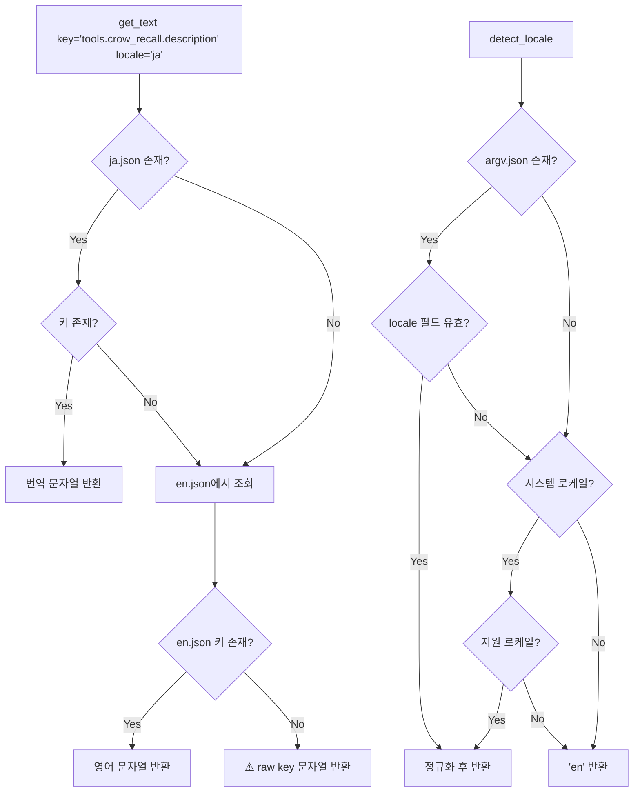

# Crow Memory i18n (국제화) 아키텍처 설계

**버전:** 1.0-draft  
**날짜:** 2026-05-29  
**설계:** Zoo (Architect mode)

---

## 개요

Crow Memory는 현재 한국어 사용자 환경에서 개발되어 [`system_prompt.example.md`](../system_prompt.example.md)의 RULE 항목과 일부 문서에 한국어가 하드코딩되어 있습니다. VS Code가 공식 지원하는 36개 로케일에서 Crow Memory가 해당 언어로 표시되도록 i18n 아키텍처를 설계합니다.

---

## 1. VS Code Locale 감지 메커니즘

### 1.1 감지 우선순위 (Fallback Chain)

```
argv.json → 시스템 로케일 → 'en'
```

### 1.2 상세 구현 방안

```python
# crow_i18n.py 내부 구현

import json
import os
import sys
import locale
from pathlib import Path

# VS Code argv.json 경로 (크로스 플랫폼)
def _get_argv_json_path() -> Path | None:
    """VS Code의 argv.json 파일 경로를 반환 (플랫폼별)."""
    if sys.platform == "win32":
        base = os.environ.get("APPDATA", "")
        return Path(base) / "Code" / "User" / "argv.json" if base else None
    elif sys.platform == "darwin":
        home = os.path.expanduser("~")
        return Path(home) / "Library" / "Application Support" / "Code" / "User" / "argv.json"
    else:  # Linux
        home = os.environ.get("XDG_CONFIG_HOME", os.path.expanduser("~/.config"))
        return Path(home) / "Code" / "User" / "argv.json"


def _parse_vscode_locale() -> str | None:
    """argv.json에서 locale 필드를 추출."""
    path = _get_argv_json_path()
    if path is None or not path.exists():
        return None
    try:
        with open(path, "r", encoding="utf-8") as f:
            # VS Code argv.json은 // 주석을 포함할 수 있음
            content = f.read()
        # 간단한 주석 제거 (한 줄 주석 // 처리)
        lines = []
        for line in content.split("\n"):
            # 문자열 밖의 // 주석만 제거 (간단한 휴리스틱)
            stripped = line.strip()
            if stripped.startswith("//"):
                continue
            # 인라인 주석은 json.loads가 실패하면 fallback
            lines.append(line)
        cleaned = "\n".join(lines)
        data = json.loads(cleaned)
        locale_value = data.get("locale")
        if isinstance(locale_value, str) and locale_value.strip():
            return locale_value.strip().lower()
    except (json.JSONDecodeError, OSError):
        pass
    return None


def _parse_system_locale() -> str | None:
    """시스템 로케일에서 언어 코드 추출."""
    try:
        loc = locale.getdefaultlocale()
        if loc and loc[0]:
            # 'ko_KR' → 'ko', 'zh_CN' → 'zh-cn'
            lang = loc[0].lower().replace("_", "-")
            # 'en-us' 같은 로케일 처리
            if "-" in lang:
                parts = lang.split("-", 1)
                # VS Code는 하이픈 사용 (zh-cn, pt-br)
                return f"{parts[0]}-{parts[1]}" if len(parts) > 1 and len(parts[1]) == 2 else parts[0]
            return lang
    except Exception:
        pass
    return None


# 지원하는 로케일 목록
SUPPORTED_LOCALES = frozenset({
    "en", "ko", "ja", "zh-cn", "zh-tw",
    "fr", "de", "it", "es", "pt-br", "ru", "tr", "pl", "cs", "hu",
    "nl", "uk", "sv", "th", "vi", "ro", "bg", "el", "hr", "id",
    "ms", "fi", "nb", "da", "sk", "sl", "et", "lv", "lt", "hi", "bn",
})


def _canonicalize_locale(raw: str) -> str:
    """로케일 문자열을 표준 형식으로 정규화."""
    loc = raw.strip().lower().replace("_", "-")
    # 정확히 일치하는 로케일이 있으면 반환
    if loc in SUPPORTED_LOCALES:
        return loc
    # 'en-us' → 'en', 'zh-hans' → 'zh-cn' 변환
    if "-" in loc:
        prefix = loc.split("-")[0]
        # 특수 매핑
        if prefix == "zh":
            # zh-hans → zh-cn, zh-hant → zh-tw
            if "hans" in loc:
                return "zh-cn"
            if "hant" in loc:
                return "zh-tw"
            return "zh-cn"  # 기본
        if prefix == "pt":
            return "pt-br"  # VS Code는 pt-br만 지원
        if prefix == "nb" or prefix == "nn":
            return "nb"  # 노르웨이어 → bokmål
        # 기타: prefix가 SUPPORTED_LOCALES에 있으면 prefix 사용
        if prefix in SUPPORTED_LOCALES:
            return prefix
    return "en"  # 최종 폴백


_detected_locale: str | None = None  # 감지 결과 캐싱


def detect_locale() -> str:
    """VS Code의 현재 로케일을 감지하여 반환. 세션당 1회만 계산."""
    global _detected_locale
    if _detected_locale is not None:
        return _detected_locale

    # 1. VS Code argv.json
    raw = _parse_vscode_locale()
    # 2. 시스템 로케일
    if not raw:
        raw = _parse_system_locale()
    # 3. 영어 폴백
    if not raw:
        raw = "en"

    _detected_locale = _canonicalize_locale(raw)
    return _detected_locale
```

### 1.3 argv.json 실제 구조

```json
// VS Code %APPDATA%\Code\User\argv.json 예시
{
    "disable-color-correct-rendering": true,
    "enable-crash-reporter": true,
    "locale": "ko",
    "password-store": "windows"
}
```

### 1.4 플랫폼별 argv.json 경로

| 플랫폼 | 경로 |
|--------|------|
| Windows | `%APPDATA%\Code\User\argv.json` |
| macOS | `~/Library/Application Support/Code/User/argv.json` |
| Linux | `$XDG_CONFIG_HOME/Code/User/argv.json` 또는 `~/.config/Code/User/argv.json` |

---

## 2. `crow_i18n.py` 모듈 인터페이스 설계

### 2.1 모듈 구조

`crow_i18n.py`는 상태를 가지지 않는 순수 함수형 모듈입니다. `detect_locale()` 호출 시 1회만 로케일을 감지하고 캐싱합니다.

### 2.2 공개 API 시그니처

```python
# crow_i18n.py — Public API

def detect_locale() -> str:
    """
    VS Code의 현재 로케일을 감지하여 반환.
    Fallback: argv.json → locale.getdefaultlocale() → 'en'
    세션 내 최초 1회만 파일 I/O 발생, 이후 캐시된 값 반환.
    
    Returns:
        str: 지원되는 로케일 코드 (예: 'ko', 'en', 'zh-cn')
    """


def get_text(key: str, locale: str | None = None) -> str:
    """
    특정 locale의 번역 문자열을 반환.
    키가 없으면 자동으로 영어(en)로 폴백.
    
    Args:
        key: 점(.)으로 구분된 중첩 키 (예: 'tools.crow_recall.description')
        locale: 로케일 코드. None이면 detect_locale() 자동 호출.
    
    Returns:
        str: 번역된 문자열
    """


def get_tool_definitions(locale: str | None = None) -> list[dict]:
    """
    locale에 맞게 번역된 MCP Tool 정의 리스트를 반환.
    툴 이름(name)과 enum 값은 번역하지 않음 (기계적 계약).
    
    Args:
        locale: 로케일 코드. None이면 detect_locale() 자동 호출.
    
    Returns:
        list[dict]: MCP ToolDefinition 형식의 딕셔너리 리스트
    """


def get_server_instructions(locale: str | None = None) -> str:
    """
    locale에 맞는 MCP 서버 instructions 문자열 반환.
    
    Args:
        locale: 로케일 코드. None이면 detect_locale() 자동 호출.
    
    Returns:
        str: 서버 소개 문자열
    """


def get_prompt_messages(locale: str | None = None) -> dict:
    """
    MCP Prompt의 description과 body 템플릿을 locale에 맞게 반환.
    
    Returns:
        dict: {
            'crow_memory_bias': {'description': '...', 'body': '...'},
            'crow_evolved_rules': {'description': '...', 'body': '...'},
        }
    """


def get_installer_messages(locale: str | None = None) -> dict:
    """
    install.py / install.ps1에서 사용할 설치 메시지 딕셔너리 반환.
    
    Returns:
        dict: {
            'banner_title': '...',
            'step_1_install_deps': '...',
            'step_2_init_crow': '...',
            'step_3_mcp_config': '...',
            'step_3_5_vscode_tasks': '...',
            'step_4_custom_mode': '...',
            'step_5_start_server': '...',
            'complete_title': '...',
            'next_steps': ['...', '...', '...', '...'],
        }
    """


def get_available_locales() -> list[str]:
    """
    번역 파일이 존재하는 모든 로케일 목록을 반환.
    """
```

### 2.3 내부 구현 설계

```python
# 내부 상세

import json
import os
from pathlib import Path

_I18N_DIR = Path(__file__).parent / "i18n"
_CACHE: dict[str, dict] = {}  # locale → parsed JSON cache


def _load_locale(locale: str) -> dict:
    """i18n/{locale}.json 파일을 로드 (캐싱)."""
    if locale in _CACHE:
        return _CACHE[locale]
    
    path = _I18N_DIR / f"{locale}.json"
    try:
        with open(path, "r", encoding="utf-8") as f:
            data = json.load(f)
    except (FileNotFoundError, json.JSONDecodeError):
        data = {}
    
    _CACHE[locale] = data
    return data


def _resolve_key(data: dict, key: str) -> str | None:
    """점(.)으로 구분된 중첩 키를 탐색하여 문자열 반환."""
    parts = key.split(".")
    current = data
    for part in parts:
        if isinstance(current, dict) and part in current:
            current = current[part]
        else:
            return None
    return current if isinstance(current, str) else None
```

---

## 3. 번역 JSON 파일 구조

### 3.1 디렉토리 구조

```
crowsmemory/
├── crow_i18n.py          # i18n 코어 모듈
├── i18n/
│   ├── en.json           # 영어 (기본/폴백)
│   ├── ko.json           # 한국어
│   ├── ja.json           # 日本語
│   ├── zh-cn.json        # 简体中文
│   ├── zh-tw.json        # 繁體中文
│   ├── fr.json           # Français
│   ├── de.json           # Deutsch
│   ├── it.json           # Italiano
│   ├── es.json           # Español
│   ├── pt-br.json        # Português
│   ├── ru.json           # Русский
│   ├── tr.json           # Türkçe
│   ├── pl.json           # Polski
│   ├── cs.json           # Čeština
│   ├── hu.json           # Magyar
│   ├── nl.json           # Nederlands
│   ├── uk.json           # Українська
│   ├── sv.json           # Svenska
│   ├── th.json           # ไทย
│   ├── vi.json           # Tiếng Việt
│   ├── ro.json           # Română
│   ├── bg.json           # Български
│   ├── el.json           # Ελληνικά
│   ├── hr.json           # Hrvatski
│   ├── id.json           # Bahasa Indonesia
│   ├── ms.json           # Melayu
│   ├── fi.json           # Suomi
│   ├── nb.json           # Norsk bokmål
│   ├── da.json           # Dansk
│   ├── sk.json           # Slovenčina
│   ├── sl.json           # Slovenščina
│   ├── et.json           # Eesti
│   ├── lv.json           # Latviešu
│   ├── lt.json           # Lietuvių
│   ├── hi.json           # हिन्दी
│   └── bn.json           # বাংলা
└── system_prompt.example/
    ├── en.md             # 영어 시스템 프롬프트 템플릿
    ├── ko.md             # 한국어 시스템 프롬프트 템플릿
    └── (locale-specific templates)
```

### 3.2 JSON 키 구조 (en.json 전체 예시)

```json
{
  "_meta": {
    "locale": "en",
    "language_name": "English",
    "version": "1.0.0",
    "last_updated": "2026-05-29"
  },

  "server": {
    "instructions": "Crow Memory — External synaptic memory for AI coding agents. Stores your coding style, bug intuition, and architectural preferences as compressed weight matrices in crow.bin.",

    "prompts": {
      "crow_memory_bias": {
        "description": "Auto-injected Crow Memory bias block. Contains your coding style, preferences, and evolved rules. The host should load this at session start.",
        "body_template": "=== Crow Memory — Auto-Injected Context ===\n\n[Permanent Evolved Rules]\n{rules}\n\n[Recent Memory Hints]\n{bias}\n\nThe above context represents your learned preferences and style. Use it to guide your responses. To learn more, call crow_recall with a specific query and register (style/bug/arch/context/life_pref/life_avoid/life_phil/life_context)."
      },
      "crow_evolved_rules": {
        "description": "Permanent evolved rules from Crow's system_prompt.md. These are statistically significant patterns approved via HITL."
      }
    }
  },

  "tools": {
    "crow_recall": {
      "description": "Recall user-specific coding style, bug intuition, architectural preference, or personal context from the Crow synaptic memory. Call this BEFORE every response to align with user's inductive bias. By default (no register, domain=all), queries all 8 registers.",
      "parameters": {
        "query": "Natural language description of the current task.",
        "register": "Which register. Use 'all' to query every register (same as domain=all). Code: style/bug/arch/context. Life: life_pref/life_avoid/life_phil/life_context.",
        "top_k": "Number of hints (1-3).",
        "domain": "Domain filter shortcut. 'code' = style/bug/arch/context, 'life' = life_pref/life_avoid/life_phil/life_context, 'all' = all 8 registers (default)."
      }
    },
    "crow_ingest": {
      "description": "Ingest a coding experience into Crow's long-term synaptic memory. Call AFTER build/test results or user explicit feedback.",
      "parameters": {
        "key": "Abstract description of the situation.",
        "value": "Code pattern or decision applied.",
        "polarity": "Reinforcement strength [-2.0, 2.0].",
        "register": "Register to store in (style/bug/arch/context/life_pref/life_avoid/life_phil/life_context)."
      }
    },
    "crow_evolve_propose": {
      "description": "Analyze recent memory patterns and propose a permanent system prompt mutation. Returns a suggestion only; human approval is required for adoption.",
      "parameters": {
        "min_confidence": "Minimum confidence threshold (default: 0.85).",
        "min_occurrences": "Minimum occurrence count (default: 3)."
      }
    },
    "crow_diagnostics": {
      "description": "Return diagnostic information about the Crow memory state (register norms, sparsity, update count, value bank size, prompt stats)."
    },
    "crow_check_drift": {
      "description": "Check if recent recalls show signs of memory drift.",
      "parameters": {
        "threshold": "Confidence threshold for low-confidence detection (default: 0.5).",
        "min_low_confidence_count": "Minimum number of low-confidence records to trigger drift (default: 5)."
      }
    },
    "crow_ingest_from_build": {
      "description": "Auto-determine polarity from build exit code and user edit status, then ingest the experience. Use this after npm run build completes.",
      "parameters": {
        "key": "Abstract description.",
        "value": "Code pattern applied.",
        "exit_code": "Build exit code (0 = success).",
        "user_edited": "Whether the user edited the AI's output.",
        "register": "Register to store in (style/bug/arch/context, default: arch).",
        "explicit_polarity": "Override auto-polarity."
      }
    },
    "crow_get_user_bias": {
      "description": "Generate the [User Bias] block for injection into the system prompt. Queries all registers and formats hints for prompt prepending.",
      "parameters": {
        "query": "Current task description.",
        "registers": "Registers to query (default: all)."
      }
    },
    "crow_manage_prompt": {
      "description": "Read, append to, or get statistics about the system_prompt.md file. Use 'read' to view current prompt, 'append' to adopt an evolved rule, 'stats' for metrics.",
      "parameters": {
        "action": "Action: read, append, or stats.",
        "rule": "Rule text (required for append action).",
        "auto_backup": "Auto-create backup before appending (default: true)."
      }
    },
    "crow_manage_backup": {
      "description": "Manage Crow memory backups. Create, rotate, list, or recover from drift.",
      "parameters": {
        "action": "Action: create, rotate, list, or recover.",
        "tag": "Backup tag: daily, weekly, or manual (default: daily).",
        "max_daily": "Maximum daily backups to keep (default: 7).",
        "max_weekly": "Maximum weekly backups to keep (default: 4)."
      }
    },
    "crow_project_info": {
      "description": "List or create project-isolated Crow memory instances.",
      "parameters": {
        "action": "Action: list or create.",
        "project_name": "Project name (required for create)."
      }
    }
  },

  "errors": {
    "unknown_tool": "Unknown tool: {name}",
    "unknown_prompt": "Unknown prompt: {name}",
    "unknown_action": "Unknown {context} action: {action}",
    "project_name_required": "project_name is required for create action"
  },

  "recall_messages": {
    "faint_bias": "Crow recalls a faint {register} bias. Few memories stored yet.",
    "unknown_register": "Unknown register: {register}"
  },

  "ingest_messages": {
    "status_ingested": "ingested",
    "unknown_register": "Unknown register: {register}"
  },

  "evolve_messages": {
    "no_patterns": "No statistically significant patterns detected yet."
  },

  "drift_messages": {
    "healthy": "Memory confidence is healthy.",
    "confused": "Crow memory seems confused. Recent tasks may be too novel or memory is saturated. Consider spectral reset or archiving."
  },

  "cli": {
    "stdio_start": "Crow Memory MCP server running on stdio",
    "sse_start": "Crow Memory MCP SSE server listening on http://{host}:{port}/sse",
    "http_start": "Crow Memory MCP Streamable HTTP server listening on http://{host}:{port}/",
    "dual_start_sse": "Crow Memory MCP SSE server listening on http://{host}:{sse_port}/sse",
    "dual_start_http": "Crow Memory MCP Streamable HTTP server listening on http://{host}:{http_port}/"
  },

  "installer": {
    "banner_title": "Crow Memory Installer for Zoo Code",
    "step_1_install_deps": "Installing Python dependencies",
    "step_2_init_crow": "Initializing crow.bin",
    "step_3_mcp_config": "Configuring MCP server (SSE mode) for Zoo Code",
    "step_3_5_vscode_tasks": "Creating .vscode/tasks.json (auto-start SSE on folder open)",
    "step_4_custom_mode": "Creating Zoo Code auto-activation mode",
    "step_5_start_server": "Starting Crow SSE server + auto-start",
    "step_done": "Done.",
    "complete_title": "Crow Memory installation complete!",
    "sse_running": "SSE server running on http://127.0.0.1:9020/sse",
    "next_steps_label": "Next steps:",
    "next_step_1": "1. Restart Zoo Code",
    "next_step_2": "2. Switch mode to \"Code + Crow Memory\"",
    "next_step_3": "3. Crow auto-activates — no manual setup needed",
    "next_step_4": "4. SSE server auto-starts with Windows (registered in Startup)"
  },

  "system_prompt": {
    "header": "# Crow Memory — System Prompt Rules",
    "subtitle": "> These rules were evolved by Crow and approved by the user.\n> They represent statistically significant coding biases.\n> Do not edit manually — use the Crow MCP evolve tools.",
    "managed_by": "<!-- This file is managed by crow_mcp_server.py -->",
    "default_rules": [
      "RULE: Before every response, call crow_recall(domain=\"all\") to query all 8 registers (style, bug, arch, context, life_pref, life_avoid, life_phil, life_context) for the user's coding style, bug intuition, architectural preferences, personal taste, philosophy, and current context. Reflect the returned hints in your response.",
      "RULE: After every response, ingest what the user revealed — preferences, philosophy, corrections, context — via crow_ingest. Judge the appropriate register and polarity yourself without waiting for the user to say \"remember this.\" After code work, auto-evaluate build results via crow_ingest_from_build.",
      "RULE: Do not skip the recall+ingest rules even for non-coding tasks such as document editing, git operations, or configuration changes. Always execute them."
    ]
  }
}
```

### 3.3 번역하지 않는 항목 (불변 원칙)

| 카테고리 | 예시 | 이유 |
|----------|------|------|
| **MCP 툴 이름** | `crow_recall`, `crow_ingest` | MCP 프로토콜 기계적 계약 |
| **Enum 값** | `style`, `bug`, `arch`, `context`, `life_pref` 등 | [`crow_core.py`](../crow_core.py) REGISTERS 상수와 일치 필요 |
| **Parameter 이름** | `query`, `register`, `polarity` | MCP inputSchema 키와 일치 |
| **Action enum** | `read`, `append`, `stats`, `create`, `rotate` 등 | [`crow_mcp_server.py`](../crow_mcp_server.py) 핸들러 분기와 결합 |
| **Domain 이름** | `code`, `life`, `all` | [`crow_core.py`](../crow_core.py) DOMAINS 상수와 일치 |
| **파일명** | `crow.bin`, `system_prompt.md` | 파일시스템 경로 |
| **슬래그** | `code-crow`, `orchestrator-crow` | Zoo Code 모드 식별자 |

---

## 4. 수정 대상 파일별 변경사항 명세

### 4.1 `crow_i18n.py` — 신규 생성

| 항목 | 설명 |
|------|------|
| **역할** | i18n 코어 모듈 |
| **의존성** | 표준 라이브러리만 사용 (`json`, `os`, `sys`, `locale`, `pathlib`) |
| **주요 함수** | `detect_locale()`, `get_text()`, `get_tool_definitions()`, `get_server_instructions()`, `get_prompt_messages()`, `get_installer_messages()` |
| **로드 방식** | `import crow_i18n` → `crow_i18n.detect_locale()` 호출 (lazy init) |

### 4.2 `crow_mcp_server.py` — 수정

| 위치 | 현재 | 변경 |
|------|------|------|
| **Import** (line 33 이후) | — | `from crow_i18n import get_tool_definitions, get_server_instructions, get_text` |
| **`create_server()`** (line 196-205) | 하드코딩된 `instructions=` | `instructions=get_server_instructions()` |
| **`handle_list_tools()`** (line 211-213) | `return [Tool(**td) for td in TOOL_DEFINITIONS]` | `return [Tool(**td) for td in get_tool_definitions()]` |
| **`handle_list_prompts()`** (line 218-231) | 하드코딩된 `description=` | `get_text("server.prompts.crow_memory_bias.description")` 등 |
| **`handle_get_prompt()`** bias body (line 241-249) | 하드코딩된 한국어/영어 혼합 메시지 | `get_text("server.prompts.crow_memory_bias.body_template").format(rules=..., bias=...)` |
| **`_error()`** (line 406-407) | — | (오류 메시지는 영어 유지, 필요시 `get_text()` 사용) |
| **`_recall()`** `faint_bias` 메시지 (crow_core.py line 289, 309) | — | `crow_core.py`는 수정하지 않고, `crow_mcp_server.py`에서 반환값을 감싸 번역 |
| **CLI 출력** (line 524, 547, 605, 610) | 하드코딩된 문자열 | `get_text("cli.sse_start", host=..., port=...)` |
| **기존 `TOOL_DEFINITIONS`** (line 45-190) | **유지** (fallback용) | `get_tool_definitions()`가 실패 시 `TOOL_DEFINITIONS`로 폴백 |

> **중요:** `TOOL_DEFINITIONS`는 하위 호환성을 위해 삭제하지 않고 보존합니다. `crow_i18n.py` 로딩에 실패하거나 `en` 로케일 폴백 시 사용됩니다.

### 4.3 `install.py` — 수정

| 위치 | 현재 | 변경 |
|------|------|------|
| **Import** (line 7 이후) | — | `from crow_i18n import detect_locale, get_installer_messages` (try/except로 감싸서 i18n 없는 환경에서도 동작) |
| **`step()` 함수** (line 54) | 하드코딩된 `msg` | `msg` 파라미터는 그대로, 호출부에서 `msgs["step_N_xxx"]` 전달 |
| **`main()` 배너** (line 63-65) | 하드코딩된 문자열 | `print(msgs["banner_title"])` |
| **Step 1-5 메시지** (line 69, 75, 90, 128, 189) | 하드코딩 | `msgs["step_1_install_deps"]` 등 |
| **완료 메시지** (line 297-308) | 하드코딩 | `msgs["complete_title"]`, `msgs["next_step_1"]` 등 |
| **YAML_MODE** (line 17-52) | 하드코딩 영어 | 언어별 `custom_modes.example.{locale}.yaml` 파일에서 로드 (또는 `system_prompt.example.{locale}.md`의 내용을 roleDefinition에 포함) |

### 4.4 `install.ps1` — 수정

| 위치 | 현재 | 변경 |
|------|------|------|
| **전체** | 하드코딩된 영어 메시지 | PowerShell에서 `crow_i18n.py` 호출하여 `get_installer_messages()` 결과를 JSON으로 받아 변수에 할당 |
| **구현 전략** | — | `$msgs = python -c "from crow_i18n import get_installer_messages; import json; print(json.dumps(get_installer_messages()))" \| ConvertFrom-Json` |

### 4.5 `system_prompt.example.md` → 분리

| 현재 | 변경 |
|------|------|
| [`system_prompt.example.md`](../system_prompt.example.md) (한국어 RULE) | `system_prompt.example/ko.md` 로 이동 |
| 신규 생성 | `system_prompt.example/en.md` (영어 템플릿) |
| [`install.py`](../install.py) line 82-86 | `system_prompt.example/{locale}.md` → `memory/system_prompt.md` 로 복사 |
| [`install.ps1`](../install.ps1) line 33-38 | 동일하게 locale-aware 복사 |

### 4.6 `crow_core.py` — 수정 안 함

[`crow_core.py`](../crow_core.py)는 코어 엔진이므로 i18n 로직을 주입하지 않습니다. 대신 MCP 서버 계층(`crow_mcp_server.py`)에서 번역을 처리합니다.

`crow_core.py` 내의 사용자 대상 메시지:
- `_nearest_hints()` line 289: `"Crow recalls a faint {register} bias. Few memories stored yet."`
- `check_drift()` line 579-583: drift 메시지
- `evolve_propose()` line 388-391: `"No statistically significant patterns detected yet."`

→ 이 메시지들은 [`crow_mcp_server.py`](../crow_mcp_server.py)의 핸들러에서 반환값을 가로채 번역합니다.

### 4.7 `AGENTS.md` — 부분 수정 (선택적)

현재 [`AGENTS.md`](../AGENTS.md)는 영어로만 작성되어 있습니다. i18n 적용 시:
- 툴 이름, enum 값은 번역하지 않음 (기계적 계약)
- 설명 텍스트만 locale-aware하게 표시하려면, `AGENTS.md` 자체를 동적 생성하는 방식 고려
- **1차 구현에서는 `AGENTS.md`는 영어로 유지** (Kimi Code CLI가 `AGENTS.md`를 직접 파싱하므로)

---

## 5. 번역 우선순위 로드맵

### Tier 1: 즉시 완역 (2개 언어)
- **en** (English) — 기본 폴백, 모든 키 완역 필수
- **ko** (한국어) — 현재 사용자 모국어, 전체 완역

### Tier 2: 1차 우선 (5개 언어)
- **ja** (日本語) — 일본어 사용자층
- **zh-cn** (简体中文) — 중국어 간체
- **zh-tw** (繁體中文) — 중국어 번체
- **fr** (Français) — 프랑스어
- **de** (Deutsch) — 독일어

### Tier 3: 2차 우선 (7개 언어)
- **es** (Español)
- **pt-br** (Português)
- **ru** (Русский)
- **it** (Italiano)
- **pl** (Polski)
- **tr** (Türkçe)
- **vi** (Tiếng Việt)

### Tier 4: 영어 폴백 허용 (22개 언어)
나머지 22개 언어는 [`en.json`](../i18n/en.json)을 복사하여 메타데이터만 수정한 후, 커뮤니티 기여로 번역을 채워나갑니다. 번역되지 않은 키는 자동으로 영어로 폴백됩니다.

---

## 6. 성능 고려사항

| 항목 | 설계 결정 |
|------|-----------|
| **Locale 감지** | 세션 시작 시 1회만 수행, 결과 캐싱 (`_detected_locale`) |
| **JSON 로딩** | locale별 최초 접근 시 1회만 로드, 메모리 캐싱 (`_CACHE`) |
| **TOOL_DEFINITIONS 생성** | `get_tool_definitions()` 호출 시 1회만 생성 후 캐싱 가능 (불변 데이터) |
| **폴백 오버헤드** | 키가 없을 때만 `en.json` 접근, 대부분의 경우 단일 파일 조회 |
| **의존성** | 표준 라이브러리만 사용 — `pip install` 불필요 |

---

## 7. 에러 처리 및 폴백 전략



핵심 원칙: **어떤 상황에서도 크래시 없이 `en` 폴백으로 정상 동작한다.**

---

## 8. `get_tool_definitions()` 변환 로직

기존 [`TOOL_DEFINITIONS`](../crow_mcp_server.py:45) 리스트의 구조를 보존하면서 `description`과 `inputSchema.properties.*.description`만 번역합니다.

```python
def get_tool_definitions(locale: str | None = None) -> list[dict]:
    """locale에 맞게 번역된 MCP Tool 정의 리스트 반환."""
    loc = locale or detect_locale()
    
    # 기본 툴 정의 (crow_mcp_server.py의 TOOL_DEFINITIONS를 복사)
    # ← 실제 구현에서는 import하여 deepcopy
    from copy import deepcopy
    tools = deepcopy(_BASE_TOOL_DEFINITIONS)
    
    for tool in tools:
        name = tool["name"]
        # description 번역
        translated_desc = get_text(f"tools.{name}.description", loc)
        if translated_desc:
            tool["description"] = translated_desc
        
        # parameter descriptions 번역
        props = tool.get("inputSchema", {}).get("properties", {})
        for param_name, param_def in props.items():
            translated_param = get_text(f"tools.{name}.parameters.{param_name}", loc)
            if translated_param:
                param_def["description"] = translated_param
    
    return tools
```

---

## 9. 요약 및 다음 단계

### 구현 파일 목록

| 파일 | 액션 | 우선순위 |
|------|------|----------|
| `crow_i18n.py` | **신규 생성** | 🔴 Critical |
| `i18n/en.json` | **신규 생성** (전체 번역) | 🔴 Critical |
| `i18n/ko.json` | **신규 생성** (전체 번역) | 🔴 Critical |
| `i18n/ja.json` ~ `i18n/bn.json` | **신규 생성** (메타+영어 폴백, 34개) | 🟡 Normal |
| `crow_mcp_server.py` | **수정** (TOOL_DEFINITIONS 동적화) | 🔴 Critical |
| `install.py` | **수정** (메시지 locale-aware) | 🟡 Normal |
| `install.ps1` | **수정** (메시지 locale-aware) | 🟡 Normal |
| `system_prompt.example.md` | **분할** → `system_prompt.example/ko.md`, `en.md` | 🟡 Normal |
| `AGENTS.md` | **변경 없음** (영어 유지) | — |

### 제약사항 준수 확인

| 제약사항 | 설계 반영 |
|----------|-----------|
| ✅ MCP 툴 이름/enum 값 번역 금지 | `get_tool_definitions()`는 `name`과 `enum`을 건드리지 않음 |
| ✅ 미번역 키 영어 폴백 | `get_text()` 내부에서 단계적 폴백 |
| ✅ 기존 기능 무영향 | `crow_i18n.py` 임포트 실패 시 기존 `TOOL_DEFINITIONS` 사용 |
| ✅ 성능 오버헤드 최소화 | Locale 1회 감지 + JSON LRU 캐싱 |
